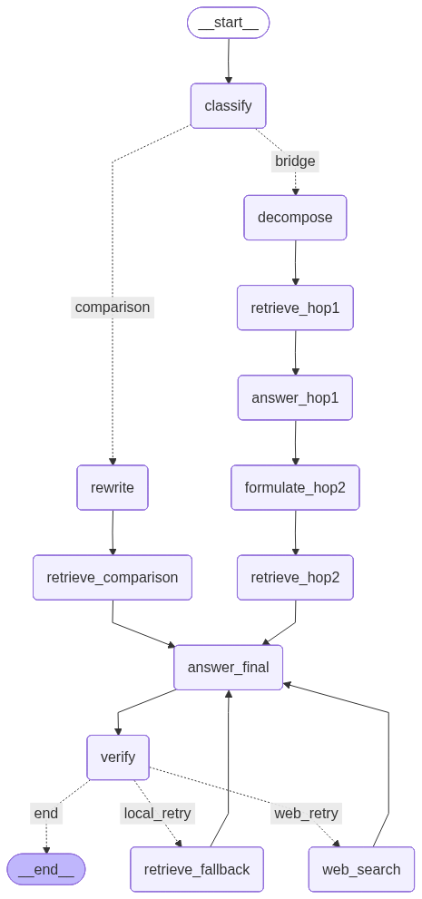

# HotpotQA Multi-Hop QA Agent

A multi-hop question answering agent built with LangGraph + Qwen2.5-3B-Instruct, trained with GRPO and distilled with a Query LoRA adapter, evaluated on HotpotQA distractor split. All reasoning happens at inference time — no pre-computed chain-of-thought.

---

## Results

The project went through two distinct phases, each revealing a key insight about what actually drives performance.

### Phase 1 — MiniLM Embedding (`all-MiniLM-L6-v2`)

Context recall ≈ 0.748. With a weaker retriever, multi-hop decomposition provides meaningful gains.

| System | EM | F1 | ctx_recall |
|---|---|---|---|
| 3B Base + Naive RAG | 0.438 | 0.539 | 0.748 |
| 3B GRPO + Naive RAG | 0.456 | 0.541 | 0.748 |
| **3B GRPO + Agent** | **0.480** | **0.567** | **0.804** |

**Finding:** Multi-hop decomposition lifts ctx_recall from 0.748 → 0.804, driving +4.2pp EM over naive RAG. The agent's decomposition was genuinely useful because retrieval was the bottleneck. GRPO contributes a stable +1.8pp on top.

---

### Phase 2 — BGE Embedding (`BAAI/bge-base-en-v1.5`)

Context recall ≈ 0.907 (+15.9pp). Stronger retrieval changes the picture entirely.

| Experiment | EM | F1 | ctx_recall |
|---|---|---|---|
| Exp0: 3B base + Naive RAG | 0.572 | 0.659 | 0.907 |
| Exp3: 3B GRPO + Agent | 0.538 | 0.625 | 0.901 |
| Exp4: 3B GRPO + Query LoRA + Agent | 0.550 | 0.639 | 0.931 |
| Exp5: Adaptive routing (comparison→RAG, bridge→agent) | 0.538 | 0.633 | 0.908 |
| **Exp6: 3B GRPO + Naive RAG** | **0.592** | **0.670** | **0.907** |
| Exp2: 32B + RAG + Agent | 0.644 | 0.714 | 0.949 |
| Exp1: 32B + Golden Passages (upper bound) | 0.786 | 0.884 | 1.000 |

**Finding:** BGE retrieval alone lifted the naive RAG baseline to 0.572, already above the multi-hop agent (0.538). The optimal combination is GRPO answer synthesis + single-hop retrieval — no decomposition needed.

**Contribution breakdown (BGE era):**
- GRPO adapter: **+2.0pp** (Exp0 → Exp6)
- Multi-hop pipeline: **−5.4pp** (Exp6 → Exp3)

**Core insight:** The multi-hop agent was solving a retrieval problem. Once BGE made direct retrieval reliable (ctx_recall 0.748 → 0.907), the pipeline's error propagation became the dominant source of failures rather than missing context.

See [`eval/EVAL_ANALYSIS.md`](eval/EVAL_ANALYSIS.md) for full experiment breakdown, case analysis, and failure taxonomy.

---

## Architecture

**Dual-role model:** A single `PeftModel` (Qwen2.5-3B-Instruct) with two LoRA adapters:
- `set_adapter("grpo")` → fine-tuned for final answer synthesis
- `set_adapter("query")` → fine-tuned for sub-query generation (Query LoRA)
- `disable_adapter()` → base model for classify / answer_hop1

**LangGraph pipeline:**
```
Bridge:     classify → decompose → retrieve_hop1 → answer_hop1
                     → formulate_hop2 → retrieve_hop2 → answer_final → verify

Comparison: classify → rewrite → retrieve_comparison → answer_final → verify

Retry:      verify fails → fallback retrieval → web search → end
```

**Retriever:** FAISS + `BAAI/bge-base-en-v1.5`, TOP_K=5, cosine similarity.



---

## Project Structure

```
├── src/
│   ├── graph.py            LangGraph pipeline (bridge + comparison + verify/retry)
│   ├── reasoner.py         LLM calls: classify, decompose, rewrite, answer
│   ├── retriever.py        FAISS dense retriever (BGE embeddings)
│   ├── evaluator.py        EM, F1, context recall, faithfulness metrics
│   └── models.py           Load PeftModel with GRPO + Query LoRA adapters
├── training/
│   ├── 01_prepare_dataset.py     HotpotQA → SFT/GRPO splits
│   ├── 02_generate_sft_data.py   32B teacher traces for SFT
│   ├── 03_train_sft.py           SFT warm-up
│   ├── 04_merge_adapter.py       Merge SFT adapter into base
│   ├── 05_train_grpo.py          GRPO fine-tuning (reward = 0.5×EM + 0.5×F1)
│   └── query_lora/               Query LoRA distillation pipeline
│       ├── 01_generate_data.py   32B teacher annotates sub_q1/sub_q2 (22K samples)
│       ├── 02_train_query_lora.py  SFT with completion-only loss
│       ├── 03_eval_subq_quality.py Sub-query quality diagnostic
│       └── 04_eval_e2e.py        End-to-end eval with dual-adapter inference
├── eval/
│   ├── exp0_3b_naive_rag.py      3B base + single-hop RAG (lower bound)
│   ├── exp1_upperbound.py        32B + golden passages (vLLM batch)
│   ├── exp2_32b_agent.py         32B + RAG + full agent
│   ├── exp3_3b_grpo_agent.py     3B GRPO + RAG + agent
│   ├── exp5_adaptive_routing.py  Adaptive routing (comparison→RAG, bridge→agent)
│   ├── exp6_grpo_naive_rag.py    3B GRPO + single-hop RAG (best result)
│   └── EVAL_ANALYSIS.md          Full experiment analysis + case study + failure taxonomy
├── results/                      JSON result files for all experiments
├── data/
│   ├── grpo_val.jsonl            500-question eval set
│   ├── corpus.jsonl              Paragraph corpus
│   └── faiss.index               FAISS index (BGE)
├── config.py                     Paths, model names, thresholds
├── run_agent.py                  Single question CLI
├── run_eval.py                   Batch evaluation
├── serve.py                      Gradio demo UI
└── debug_agent.py                Step-by-step agent trace
```

---

## Setup

```bash
pip install -r requirements.txt
```

Models are loaded from HuggingFace automatically:
- Base: `Qwen/Qwen2.5-3B-Instruct`
- GRPO adapter: `Norm11/qwen2.5-3b-sft-grpo-hotpotqa_v3/grpo_adapter`
- Query LoRA: `Norm11/qwen2.5-3b-querylora-hotpotqa/final`
- Embedding: `BAAI/bge-base-en-v1.5`

---

## Run

```bash
# Single question
python run_agent.py --question "Were Scott Derrickson and Ed Wood of the same nationality?"

# Batch eval (500 questions, reuse saved index)
python run_eval.py --load-index --output results/eval.json

# Step-by-step debug
python debug_agent.py --question "..."
```

**Local demo UI** (Gradio):
```bash
python serve.py --load-index
# Open http://localhost:7860
```
Shows each agent step in real time: classify → decompose → retrieve → answer → verify, with keyword highlighting on retrieved passages.

---

## Training (GPU required, A100 80GB)

**GRPO training pipeline:**
```bash
python training/01_prepare_dataset.py
python training/02_generate_sft_data.py
python training/03_train_sft.py
python training/04_merge_adapter.py
torchrun --nproc_per_node=4 training/05_train_grpo.py --epochs 2 --max-samples 30000
```

**Query LoRA distillation:**
```bash
python training/query_lora/01_generate_data.py --load-index
python training/query_lora/02_train_query_lora.py
python training/query_lora/03_eval_subq_quality.py --load-index
python training/query_lora/04_eval_e2e.py --load-index
```

Trained adapters and datasets on HuggingFace:
- GRPO adapter: `Norm11/qwen2.5-3b-sft-grpo-hotpotqa_v3`
- GRPO training data: `Norm11/qwen2.5-3b-sft-grpo-hotpotqa-dataset`
- Query LoRA adapter: `Norm11/qwen2.5-3b-querylora-hotpotqa`
- Query LoRA training data: `Norm11/qwen2.5-3b-querylora-hotpotqa-dataset`
