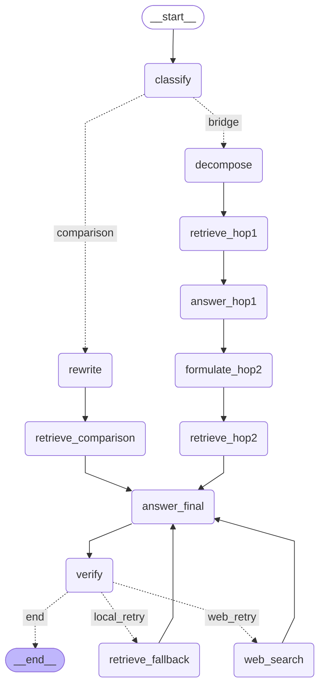

# Agent Graph

Render at https://mermaid.live

```mermaid
---
config:
  flowchart:
    curve: linear
---
graph TD;
	__start__([<p>__start__</p>]):::first
	classify(classify)
	decompose(decompose)
	retrieve_hop1(retrieve_hop1)
	answer_hop1(answer_hop1)
	formulate_hop2(formulate_hop2)
	retrieve_hop2(retrieve_hop2)
	rewrite(rewrite)
	retrieve_comparison(retrieve_comparison)
	answer_final(answer_final)
	verify(verify)
	retrieve_fallback(retrieve_fallback)
	web_search(web_search)
	__end__([<p>__end__</p>]):::last
	__start__ --> classify;
	answer_final --> verify;
	answer_hop1 --> formulate_hop2;
	classify -. &nbsp;bridge&nbsp; .-> decompose;
	classify -. &nbsp;comparison&nbsp; .-> rewrite;
	decompose --> retrieve_hop1;
	formulate_hop2 --> retrieve_hop2;
	retrieve_comparison --> answer_final;
	retrieve_fallback --> answer_final;
	retrieve_hop1 --> answer_hop1;
	retrieve_hop2 --> answer_final;
	rewrite --> retrieve_comparison;
	verify -. &nbsp;end&nbsp; .-> __end__;
	verify -. &nbsp;local_retry&nbsp; .-> retrieve_fallback;
	verify -. &nbsp;web_retry&nbsp; .-> web_search;
	web_search --> answer_final;
	classDef default fill:#f2f0ff,line-height:1.2
	classDef first fill-opacity:0
	classDef last fill:#bfb6fc

```
